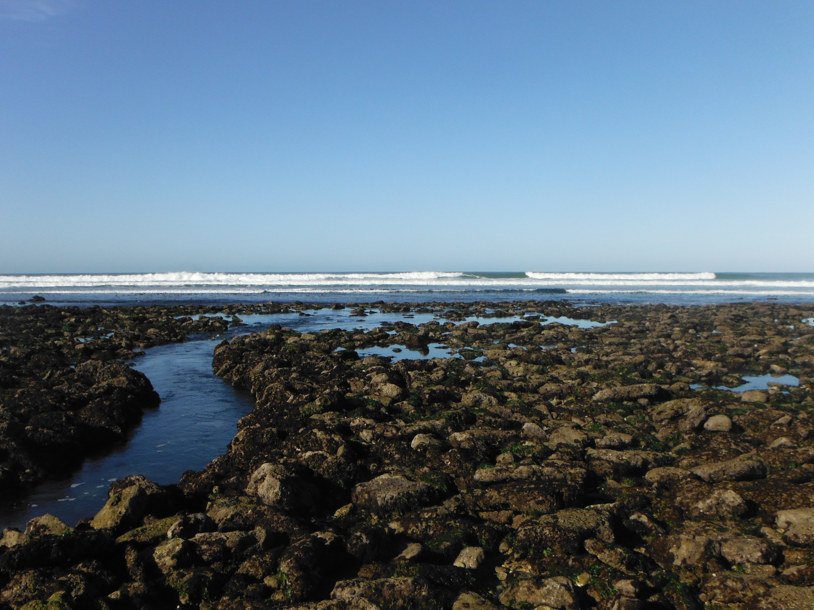
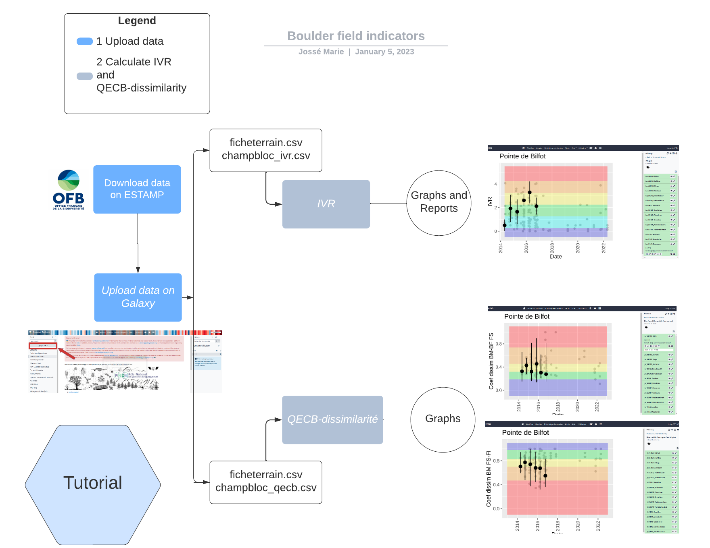
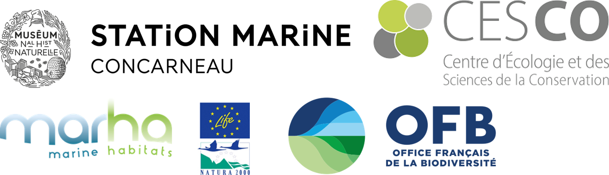

# A bit of context : what is a boulder field?

Sea boulder fields on the west coast of France are accumulations of bedrock blocks that have gathered on beaches. These fields can expand on several kilometers and are accessible depending on the tides. They are typically found in sandy, rocky, and coastal environments and can provide a challenging terrain to traverse. Anyway, see for yourself a picture is worth a thousand words. 

# Why is this project important?

The "mediolittoral boulder fields" habitat harbors a high diversity of micro-habitats and species due to its high structural heterogeneity and its intermediate position on the foreshore, which makes it one of the most diversified mediolittoral habitats and of high ecological interest along the French Channel-Atlantic coast. It is also a very attractive habitat for recreational fishing, which, through the reworking of the blocks, can impact the communities.
Thus, the "mediolittoral boulder fields" habitat has been the subject of several national and local initiatives (including LIFE+ "Experimentation for a sustainable and concerted management of recreational foot fishing in France" 2013-2017) to better assess its status and relate it to the pressure of foot fishing with a view to adapting local management, particularly through the network of Marine Protected Areas (Natura 2000, PNM, PNR etc.).

In particular, these projects have made it possible to develop a network of involved field players and managers and tools for evaluating the ecological status and pressure of fishing on foot.

# What is the role of Galaxy here ?

<Galaxy logo src="galaxy_project_logo.png" widht="10" height="50">
  

The implementation of said tools for evaluating the ecological status and pressure of fishing on foot in Galaxy allow an easy access to 2 indicators :

- the Visual Boulder Turning Indicator (VTI), which is similar to a "landscape" indicator to assess fishing pressure based on architectural criteria [IVR](toolshed.g2.bx.psu.edu/repos/ecology/cb_ivr/cb_ivr/0.0.0);

- the Boulder Field Ecological Quality Index (BFEQ) - which gives variables that respond to the disturbance "boulder turning" [QECB-dissimilarity](toolshed.g2.bx.psu.edu/repos/ecology/cb_dissim/cb_dissim/0.0.0.).

This last indicator can be combine with a third tool giving common biodiversity indicators (shannon, simpson,...) using the r package adiv [Diversity](toolshed.g2.bx.psu.edu/repos/ecology/cb_div).

This way anyone can better apprehend the workflow for indicators on boulder fields. This will help you understand the effects of global and local changes on marine habitats, and the effectiveness of the management measures adopted, requires standardized monitoring and robust and sensitive indicators reflecting the state of the habitats.

## Creating Awareness and Culture

This workflow of indicators illustrates the evolution over time of the pressure of fishing with a shovel. It can help make aware the fishers comunity of their impact on the boulder fileds biodiversity and help to better manage these fields.

## Training material 

A training material has been be developed to guide you on how to use these tools [Tutorial](https://training.galaxyproject.org/training-material/topics/ecology/tutorials/champs-blocs/tutorial.html). Real soon the part to use the third Diversity will be added there. 

